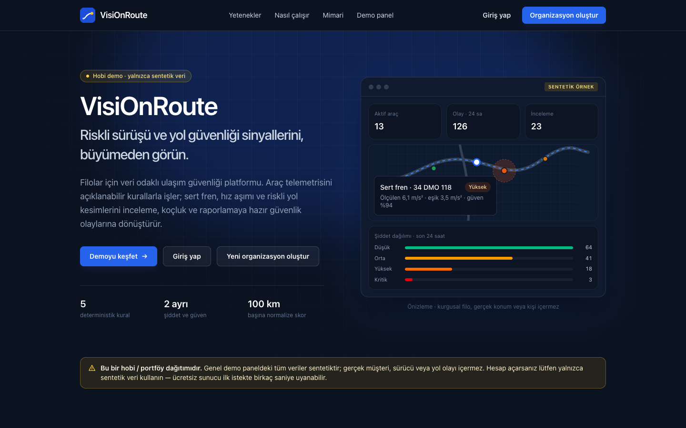
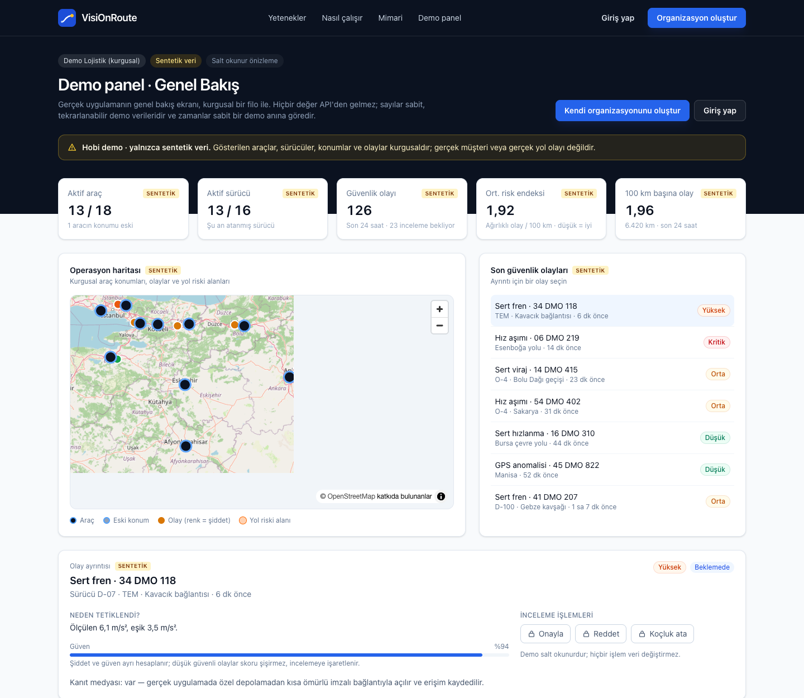
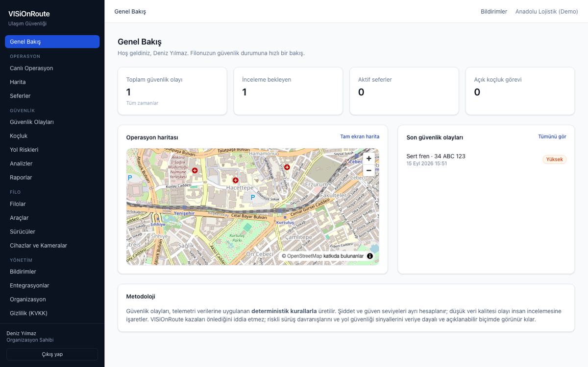
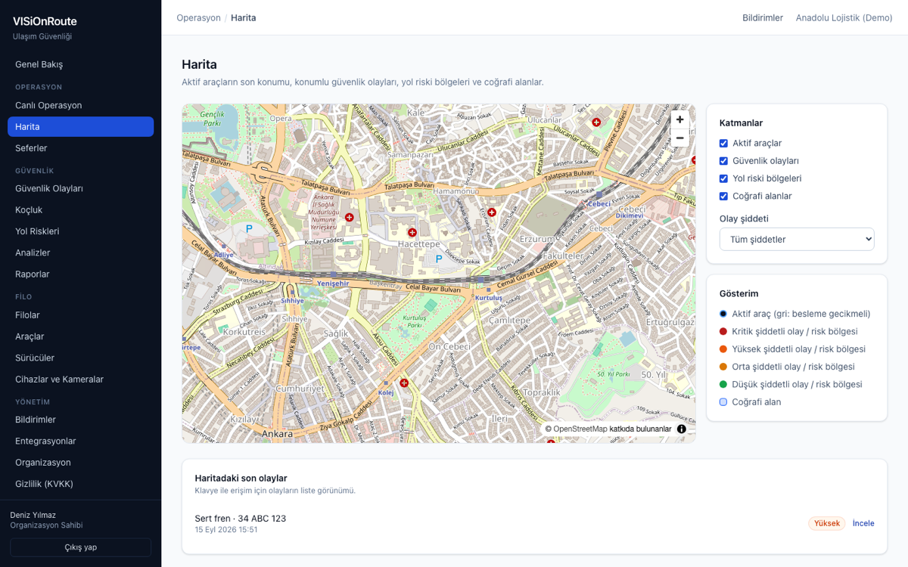

# VisiOnRoute

**A Turkish-language transportation-safety SaaS that helps fleets surface risky driving
behaviour and road-safety signals from telemetry — with every finding explainable.**

**Live demo: <https://visionroute.vercel.app>** — public landing page, a read-only
[demo dashboard](https://visionroute.vercel.app/demo), and self-service registration.

> **The public demo uses synthetic data only.** The `/demo` dashboard renders fixed,
> fictional fixtures (a made-up fleet with `DMO` plates and pseudonymous drivers); it never
> calls the API and shows no tenant data. Organisations you register on the hobby
> deployment are real accounts on free-tier infrastructure — use synthetic data only.
> The API runs on a free tier and may take up to a minute to wake on the first request.



VisiOnRoute ingests vehicle telemetry, applies deterministic rules to it, and turns the
results into reviewable safety events, driver coaching, road-risk clusters, reports and
KVKK (Turkish GDPR) workflows. The entire customer-facing product is in Turkish; the code,
comments and this README are in English.

> VisiOnRoute does **not** claim to prevent accidents and does not replace legal, medical,
> occupational-safety, automotive or human judgement. Every event states which rule fired,
> which data it used, the threshold, the measured value and the confidence — so a human can
> disagree with it.



*Public demo dashboard (`/demo`): KPIs, operations map, recent events with rule
explanations, severity and rule breakdowns, hourly activity and an exposure-normalised
driver ranking — all synthetic, all read-only. Review actions explain that they need a
signed-in account instead of acting.*



*The authenticated overview: fleet safety at a glance — open events, active trips, coaching
workload, and the operations map. The interface is Turkish throughout; all data shown is
synthetic.*

## The problem

Fleet operators drown in raw telematics. Speed and acceleration traces alone do not tell a
safety manager *which* moments deserve attention, whether a signal is trustworthy, or what
to do next. Black-box "driver scores" make that worse: they cannot be explained to the
driver being judged.

VisiOnRoute takes the opposite approach:

- **Deterministic, versioned rules** (harsh braking/acceleration/cornering, speeding) — no
  LLM ever classifies numeric telemetry.
- **Severity and confidence are computed separately.** Poor GPS quality lowers confidence and
  flags the event for human review instead of silently inflating a score.
- **Exposure-normalised driver scoring** (per 100 km, minimum 50 km before any score) with no
  hidden or demographic variables.
- **Every number is traceable** to the rule version, the telemetry window and the data source.

## Capabilities

| Area | What it does |
|------|--------------|
| Identity | Registration, e-mail verification, login, single-flight session refresh, password reset, TOTP MFA with recovery codes, organisation-wide MFA policy |
| Team | Invitations by e-mail, 10 tenant roles, 28 permissions, deny-by-default checks in the application layer |
| Fleet | Fleets, vehicles (with inline editing), drivers, time-bounded driver–vehicle assignments, devices, cameras |
| Ingestion | Versioned REST event contract + CSV import, API keys with scopes and revocation, deduplication, quarantine with Turkish reasons |
| Operations | Trips built from telemetry, live vehicle positions over SSE (with polling fallback), trip detail with route trail |
| Safety | Explainable safety events, deduplication, review workflow (confirm/reject/uncertain), evidence media with signed URLs |
| Coaching | Assign, start, complete or cancel coaching actions, with outcomes and overdue tracking |
| Risk | Road-risk clustering from repeated harsh events, geofences, exposure-normalised driver risk scores |
| Map | MapLibre + OpenStreetMap view of live vehicles, located events, road-risk areas and geofences (no API key) |
| Analytics & reports | Severity distribution, events per 100 km, confirmation rate, CSV exports and a Turkish-typeset executive PDF |
| Notifications | Severity-based rules, in-app notifications, HMAC-signed webhooks with retries, dead-letter and delivery history |
| Privacy (KVKK) | Data-subject export and erasure requests, retention policy per data category, rate-limited and audited |
| SaaS | Plans, trials, vehicle/user limits enforced server-side, daily usage metering, platform-admin screens |
| Public site | Product landing page and a read-only `/demo` dashboard rendered from deterministic synthetic fixtures (no API calls, no tenant data) |

Deliberately **not** built (and never faked in the UI): automatic face/licence-plate
anonymisation, malware scanning of uploads, a payment provider, and MQTT/Kafka ingestion
adapters. The UI states these limits where a user would otherwise assume them.

## Architecture

```
apps/web (Next.js 15, Turkish UI)
      │  JSON over HTTPS, Zod-validated at the boundary
      ▼
src/visionroute/api (FastAPI)
      │  application services  ── ports/protocols ──► infrastructure adapters
      ▼                                                  (SQLAlchemy 2 async, S3, SMTP, Redis)
PostgreSQL 17 + PostGIS  ◄── outbox_events ──►  worker (FOR UPDATE SKIP LOCKED)
                                                scheduler (partitions, retention, metering)
```

A modular monolith with import-linter-enforced layers: `domain` (pure logic, no framework
imports) → `application` (use cases and ports) → `infrastructure` / `api` / `worker` /
`scheduler` / `cli`. PostgreSQL is the single source of truth and carries row-level security
on every tenant table; Redis is only cache and rate limiting; events flow through a
transactional outbox consumed by the worker.



*Map: live vehicle positions, located safety events, road-risk areas and geofences on
MapLibre + OpenStreetMap tiles — no API key, with a list view beside it for keyboard access.*

## Stack

Python 3.13, FastAPI, SQLAlchemy 2 (async), Alembic, Pydantic v2, PostgreSQL 17 + PostGIS,
Redis, Typer CLI · Next.js 15, React 19, TypeScript strict, TanStack Query, Zod, Tailwind v4,
MapLibre GL · Docker, Terraform (AWS), GitHub Actions.

## Run the local demo

Requirements: Docker, or Python 3.13 + Poetry 2 + Node 22 + pnpm 9 with local PostgreSQL 17
(+PostGIS) and Redis.

```bash
poetry install
poetry run visionroute keys generate --out .dev/keys
poetry run visionroute keys generate-field-key >> .env
docker compose --profile full up -d --build
```

Defaults: web <http://localhost:3000>, API <http://localhost:8000>, Mailpit
<http://localhost:8025>. If those ports are taken, override them in `.env` (`VR_WEB_PORT`,
`VR_API_PORT`, `VR_PG_PORT`, `VR_REDIS_PORT`, `VR_MINIO_PORT`, `VR_MINIO_CONSOLE_PORT`,
`VR_SMTP_PORT`, `VR_MAILPIT_PORT`) and rebuild with `--build` when the API port changes.

The full demo walkthrough — register, verify by e-mail, add a vehicle, create a data source
and API key, send synthetic telemetry, review the event, assign coaching — is in
[`docs/operations/demo-profile.md`](docs/operations/demo-profile.md).

### Synthetic data only

The simulator (`poetry run visionroute simulate telemetry …`, or `make seed-demo`) marks every
event with `data_origin="synthetic"` and `environment="demo"`. Synthetic data must never be
presented as production evidence, and the public demo deployment is for synthetic data only.

## Tests and quality gate

```bash
make check                                    # format, lint, import boundaries, mypy, tests, bandit
cd apps/web && pnpm typecheck && pnpm lint && pnpm test && pnpm build
make e2e                                      # Playwright against a real API, worker and production build
```

Current state on this tree: **253 backend tests** (unit, integration, security, contract;
1 skipped without a local MinIO/DejaVu environment), **22 Vitest** unit tests, **27 Playwright
end-to-end tests**, **17 Alembic migrations** verified up → down → up with a clean
`alembic check`. Ruff, mypy strict, import-linter, Bandit, pip-audit and `pnpm audit --prod`
all run in CI and are blocking.

## Security and privacy posture

- RS256 JWTs only, short-lived access tokens, refresh-token rotation with reuse detection and
  family revocation; refresh token in an HttpOnly cookie, access token in memory only.
- Row-level security on every tenant table, plus explicit application-layer permission checks.
- Field-level encryption (Fernet key ring, rotatable) for webhook secrets and MFA secrets.
- Argon2id password hashing, account lockout, Redis sliding-window rate limits.
- Evidence media in private buckets behind short-lived signed URLs, with access audited.
- SSRF guard on every user-supplied URL; HMAC-signed webhooks with replay defence.
- Append-only audit log enforced by a database trigger.
- AI assistance is disabled by default and may never classify telemetry, make disciplinary
  decisions, write SQL or invent evidence ([ADR-0008](docs/adr/)).

Details: [`docs/THREAT_MODEL.md`](docs/THREAT_MODEL.md), [`docs/security/`](docs/security/).

## Repository layout

| Path | Contents |
|------|----------|
| `src/visionroute/` | Backend modular monolith: `domain`, `application`, `infrastructure`, `api`, `worker`, `scheduler`, `cli` |
| `apps/web/` | Next.js Turkish frontend; `e2e/` Playwright suite |
| `infra/docker/` | Production images (API/worker/scheduler, web) |
| `infra/terraform/` | AWS infrastructure (staging, production) |
| `docs/` | Decisions, ADRs, operations runbooks, threat model, release status |
| `tests/` | `unit`, `integration`, `contract`, `security` |
| `render.yaml` | Zero-cost hobby demo blueprint (not the production topology) |

## Status

Feature-complete for a controlled pilot and verified locally: the full Docker Compose stack
runs, migrations apply cleanly, and the end-to-end suite exercises the real API, worker and a
production web build. Not yet run in a real AWS environment — `terraform plan`/`apply` have
never been executed, so no production-readiness claim is made. Open items, deliberate
omissions and their reasons are tracked honestly in [`docs/HANDOVER.md`](docs/HANDOVER.md) and
[`docs/RELEASE_READINESS.md`](docs/RELEASE_READINESS.md).

A separate zero-cost hobby deployment profile (Vercel + Render free tier, Neon, Upstash,
Backblaze B2, Brevo) is documented in
[`docs/operations/hobby-deployment.md`](docs/operations/hobby-deployment.md), including its
free-tier limitations such as cold starts.

## License

Proprietary. All rights reserved.
